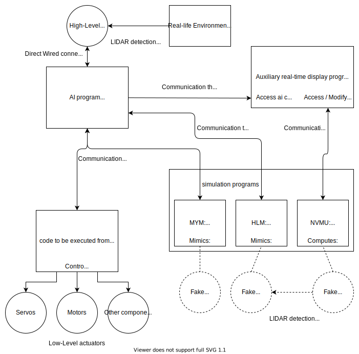

# 2021_Robot_B

Code du robot des 1A du club ENAC Robotique pour la coupe de France de Robotique 2021

## Principe de base du robot:

Le robot est divisé en plusieurs parties:
- Carte Raspberry Pi:

Une carte faisant tourner le système d'exploitation Linux, et donc dotée d'une certaine puissance de calcul.
Elle hébergera le programe AI du projet, qui prendra en charge la gestion des actions, les calculs de déplacement (évitement, pathfinding), ainsi que la communication avec des périphériques de haut-niveau et de bas-niveau (par l'intermédiaire du microcontrolleur).

- Microcontrolleur Teensy:

Une carte disposant de moins de puissance de calcul, mais plus apte à controller les périphériques de bas-niveau tel que les moteurs, servomoteurs, encodeurs, etc.
Cette carte devra exécuter les instructions reçues par voie série envoyées par le RPi, et pourra lui envoyer des messages contenant par exemple des informations de positions calculées d'après les mouvements de roues encodeuses.

- Périphériques de haut-niveau:

Dans cette catégorie est par exemple rangé le LIDAR, qui permet d'obtenir des informations sur les objets se trouvant dans l'envrionnement du robot (autres robots en mouvement par exemple), ou un éventuel capteur de distance à ultrasons (si implémenté). Ils sont controllés directement par le RPi.

- Périphérique de bas-niveau:

Dans cette catégorie sont rangés les moteurs, servomoteurs, encodeurs et autres actionneurs nécessitant d'être controllés précisément. Ils sont controllés par le microcontrolleur.

## Structure Logicielle

En raison de la pandémie de Coronavirus, et du confinement, il ne nous est pas possible de travailler en mélangeant phase de conception et phase pratique. Il est donc nécessaire de pouvoir tester certaines parties du programme qui nécéssite des composants physiques, comme les moteurs, capteurs et autres.

Il a donc été décidé de développer des programmes reproduisant le comportement de ces composants physiques, et permettant de tester des algorithmes s'appuyant sur l'environnement physique du robot.

Schéma représentatif de l'architecture logicielle des différents programmes

### Programmes qui seront embarqués sur le robot (/real/)

- real/ai.py:

Le programme qui sera hébergé sur le RPi. Ce programme prendra en charge la gestion des actions, les calculs de déplacement (évitement, pathfinding), l'envoi/réception de messages par la voie série avec le microcontrolleur et controller les périphériques de haut-niveau.

- real/micro.c: (nom hypothétique)

Le programme sera hébergé sur le microcontrolleur.
Il devra gérer l'envoi/réception de messages par la voie série avec le RPi, et controller les différents périphériques de bas-niveau.

(Les dépendances ne sont pas indiquées ici, merci de vous référer aux README de chaque dossier.)

### Programmes destinés à la simulation (/simu/)

- simu/mym.py:

Ce programme a pour but de reproduire le comportement du microcontrolleur, ainsi que des périphériques de bas-niveau qui y seront connectés. Il est possible d'introduire des erreurs factices afin de tester la robustesse du reste du programme.

- simu/hlm.py:

Ce programme a pour but de reproduire le comportement des périphériques de haut-niveau qui seront connectés au RPi (notamment le LIDAR). Ce programme pourra exploiter les données du NVMU (émulateur d'environnement afin de permettre le test d'algorithmes basés sur l'environnement du robot (comme la détection d'obstacles ou le pathfinding)).

- simu/nvmu.py:

Ce programme a pur but de créer un environnement virtuel qui puisse être exploités par les périhpériques de haut-niveau virtuels, en absence de tests physique. Une fidélité physique complète n'est pas le but recherché, le NVMU ne sera qu'en 2D, le but ne'étant que de pouvoir affiner les algorithmes qui seront utilisés sur le vrai robot.

- simu/emulate_serial_ports.sh:

Un script permettant de mettre en place des canaux de communication série virtuels.

### Programme annexe dédié à la visualisation (/visu/)

- visu/visu.py: (nom hypothétique)

Le but de ce programme est d'offrir aux développeurs un moyen de regarder en temps réel ce que l'AI calcule, et si les résultats sont conformes aux attentes. Le programme pourra accéder aux informations calculées par l'AI, et pourra voir ou modifier le NVMU si il est lancé, afin de voir la réaction du robot.
