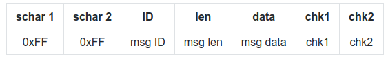

# Communication

# Serialization

Messages serialization/deserialization is done with protobuf.

`def.proto` contains the messages definitions.

Generate python files with : `protoc --python_out=./ def.proto`

See python tutorial: https://developers.google.com/protocol-buffers/docs/pythontutorial

The teensy will use the [nanopb](https://github.com/nanopb/nanopb) library.

# Encapsulation

Encapsulation is handled by `serialcom.py` with the following format:

